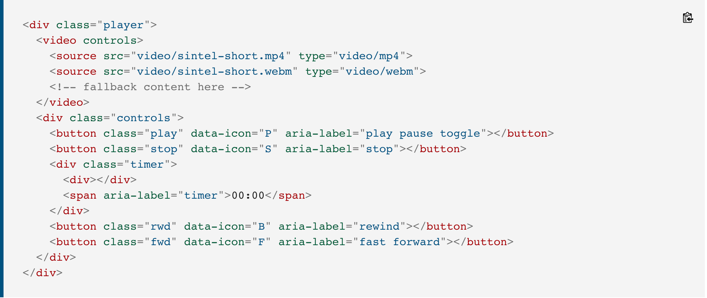

# Audio, Video, Images

## Images

- specify dimensions with CSS (helpful when using same size images)
- can be aligned horizontally and vertically
- can use background img behind box created by any elemet on page
- backgound imgs can appear once or be repeated across the background of the box
- create img rollover effects by moving the background position of an img
- use img sprites to reduce number of imgs your browser has to load

## Practical Information

- SEO helps visitors find your sites when using search engines
- Analytic tools (Google Analytics) allows you to see how many people visit, how they found it, and what they did there
- To put site on web, you will need to obtain a domain name and web hosting
- FTP programs allow you to transfer files from your local computer to your web server
- many companies provide platforms for blogging, email, newsletters, e-commerce and other popular website tools

## Video and Audio APIs

### HTML

- `<video>` and `<audio>` come with their own APIs
  - allow you to embed video and audio in pages
- `<controls>` enables the default set of playback controls
  - not very good for cross-browser support as controls can look different
  - you can program your own instead
- the `HTMLMediaElement` API provides features to allow you to control audio and video players pragrammatically
  - `HTMLMediaElement.play()`, `HTMLMediaElement.pause()`
  - this interface is available to both `<audio>` and `<video>`  

Mozilla - Video and Audio APIs

- whole player is in a `
` so it can all be styled as one unit if needed
- `<video>` contains two `<source>` elements so different formats can be loaded depending on the browser
- four `<button>` - play/pause, stop, rewind, fast forward
- each `<button>` has a `class` name, a `data-icon` (for defining what icon should be shown on each button), and an `aria-label` (are read out by screenreaders when their users focus on the elements that contain them)
- timer `
` - will report the elapsed time when the video is playing, `` containing the elapsed time in mins and secs, and an extra `
` to create a horizontal indicator bar that gets longer as time elapses

### CSS

- `.controls {`
- `visibility: hidden;` - we will fix in JS
- `opacity: 0.5;` - less distracting when you are trying to watch the video
- `display: flex;` - Flexbox for buttons
- `@font-face {` - block to import a custom icon web font
- `button:before {` - to display content before each `<button>` element
- `content:` property to set the content to be displayed in each case to be equal to the contents of the `data-icon` attribute
- can use `color:` and `text-shadow`
- set the outer `.timer` `
` to have flex: 5 so it takes up most of the width of the controls bar

